<a href='https://www.linkedin.com/in/alexander-knips-45794240/' target="_blank"></a><a href='https://xtermjs.org/' target="_blank"></a>

# 1. Project Description
This is an interactive terminal based CV built with
- Written in [Typescript](https://www.typescriptlang.org/)
- [Nest JS](https://nextjs.org/)
- [OpenAI API](https://openai.com/product)
- XtermJS [XtermJS](https://xtermjs.org/)
- Deployed to [Vercel](https://vercel.com)

I also wrote an article of how I wrote the code, it's available either on  (Hashnode)[https://hashnode.com/post/clqufyl0k000508jt5xcd83y2] or (Medium)[https://medium.com/@alexanderknips/my-interactive-resume-terminal-15fa5e32c4d2].

# 3. Architecture
I believe that the (C4 Model)[https://c4model.com/] currently is the best way to describe architecture through diagrams. Hence, it will be used here as appropriate. 

The following system context diagram focusses on the single software system in question, the CV resume system. 

```mermaid
graph TB
  linkStyle default fill:#ffffff

  subgraph diagram ["CV Software System - System Context"]
    style diagram fill:#000000,stroke:#ffffff

    2["<div style='font-weight: bold'>User</div><div style='font-size: 70%; margin-top: 0px'>[Person]</div><div style='font-size: 80%; margin-top:10px'>A user of my software system.</div>"]
    style 2 fill:#08427b,stroke:#052e56,color:#ffffff
    3["<div style='font-weight: bold'>OpenAI system</div><div style='font-size: 70%; margin-top: 0px'>[Software System]</div><div style='font-size: 80%; margin-top:10px'>The OpenAI System that<br />includes their API.</div>"]
    style 3 fill:#6aa84f,stroke:#4a7537,color:#000000
    4["<div style='font-weight: bold'>CV Software System</div><div style='font-size: 70%; margin-top: 0px'>[Software System]</div><div style='font-size: 80%; margin-top:10px'>Interactive CV software<br />system.</div>"]
    style 4 fill:#6aa84f,stroke:#4a7537,color:#000000

    2-. "<div>Uses [Web]</div><div style='font-size: 70%'></div>" .->4
    4-. "<div>Interacts through OpenAI API<br />[HTTPS]</div><div style='font-size: 70%'></div>" .->3
  end
```



The OpenAI system and context is described as the following

```mermaid
graph TB
  linkStyle default fill:#ffffff

  subgraph diagram ["OpenAI system - System Context"]
    style diagram fill:#000000,stroke:#ffffff

    1["<div style='font-weight: bold'>Admin</div><div style='font-size: 70%; margin-top: 0px'>[Person]</div><div style='font-size: 80%; margin-top:10px'>The admin of the GPT<br />assistant.</div>"]
    style 1 fill:#08427b,stroke:#052e56,color:#ffffff
    3["<div style='font-weight: bold'>OpenAI system</div><div style='font-size: 70%; margin-top: 0px'>[Software System]</div><div style='font-size: 80%; margin-top:10px'>The OpenAI System that<br />includes their API.</div>"]
    style 3 fill:#6aa84f,stroke:#4a7537,color:#000000
    4["<div style='font-weight: bold'>CV Software System</div><div style='font-size: 70%; margin-top: 0px'>[Software System]</div><div style='font-size: 80%; margin-top:10px'>Interactive CV software<br />system.</div>"]
    style 4 fill:#6aa84f,stroke:#4a7537,color:#000000

    1-. "<div>Configures assistant</div><div style='font-size: 70%'></div>" .->3
    4-. "<div>Interacts through OpenAI API<br />[HTTPS]</div><div style='font-size: 70%'></div>" .->3
  end
```



Within the CV system the different containers are described as

```mermaid
graph LR
  linkStyle default fill:#ffffff

  subgraph diagram ["CV Software System - Containers"]
    style diagram fill:#000000,stroke:#ffffff

    2["<div style='font-weight: bold'>User</div><div style='font-size: 70%; margin-top: 0px'>[Person]</div><div style='font-size: 80%; margin-top:10px'>A user of my software system.</div>"]
    style 2 fill:#08427b,stroke:#052e56,color:#ffffff

    subgraph 4 [CV Software System]
      style 4 fill:#000000,stroke:#80c561,color:#80c561

      5["<div style='font-weight: bold'>NextJS Client</div><div style='font-size: 70%; margin-top: 0px'>[Container: Allows the user to ask questions about the particular resume in question and display pre-defined employment and education histories.]</div><div style='font-size: 80%; margin-top:10px'>Typescript, NextJS</div>"]
      style 5 fill:#dddddd,stroke:#9a9a9a,color:#000000
      6["<div style='font-weight: bold'>NextJS Server</div><div style='font-size: 70%; margin-top: 0px'>[Container: Keeps the OpenAI thread in memory and interacts with the assistant API.]</div><div style='font-size: 80%; margin-top:10px'>Typescript, NextJS</div>"]
      style 6 fill:#dddddd,stroke:#9a9a9a,color:#000000
    end

    5-. "<div>REST [HTTPS]</div><div style='font-size: 70%'></div>" .->6
    2-. "<div>Uses [Web]</div><div style='font-size: 70%'></div>" .->5
  end
```


This is so simple and standard in NextJS that it does not warrant any further diagrams. The NextJS application has a single module and code diagrams are not further required. No external state is persisted.

Notes: These diagrams were originally created with [Structurizr](https://structurizr.com/dsl) and then exported to Mermaid. 

# 4. How to Install and Run the Project

## Running the server locally

First, run the development server:

```bash
npm run dev
# or
yarn dev
# or
pnpm dev
# or
bun dev
```

Open [http://localhost:3000](http://localhost:3000) with your browser to see the result.

# 5. How to Use the Project

Feel free to use this project according to the MIT license. Accredication not required but appreciated. 
Right now the employment and education data returned visually is just objects in the folder https://github.com/alexknips/nextjs-cv/tree/main/src/app/data.
This can be easily be improved upon to use a different data store.

# 6. Credits

Thank you vercel and the NextJS project for getting started quickly. See: [https://vercel.com/solutions/nextjs](NextJS Vercel page) and [https://github.com/vercel/next.js](NextJS Github).
